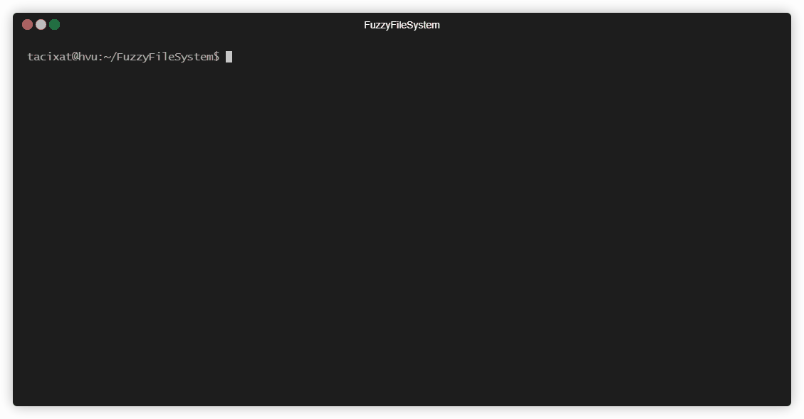

# FFS

A file mutator implemented as an in-memory file system. 


*This was an early proof of concept, see full [interface](https://github.com/TACIXAT/FuzzyFileSystem#interface) below!*

## Practical

### Install

#### Ubuntu / Debian

Requires [Golang](https://golang.org/dl/).

```bash
sudo apt install fuse3 git
git clone git@github.com:tacixat/FuzzyFileSystem
go get bazil.org/fuse
mkdir /mnt/ffs
```

#### Docker

Requires [Docker](https://www.docker.com/products/docker-desktop).

```bash
git clone git@github.com:tacixat/FuzzyFileSystem
cd FuzzyFileSystem
docker build -t ffs/main .
docker run -it --rm --cap-add SYS_ADMIN --device /dev/fuse --name ffs ffs/main
```

### Run

```bash
cd FuzzyFileSystem
go run *.go -mp /mnt/ffs
```

#### Usage

```bash
Usage of ffs:
  ffs -mp /some/mount/point
  -bs uint
        mutate batch size (default 10)
  -mp string
        /mnt/point
  -s int
        rand seed (default 0)
```

### Cleanup

```bash
umount /mnt/ffs
```

## Interface

When started your mountpoint will contain a file `info`. This is to provide information about the invocation of FFS.

```
/mnt/ffs/
  info
```

Interfaces take and return `JSON`.

```bash
$ cat /mnt/ffs/info
{"seed":0,"batch_size":10}
```

Writing a file into `/mnt/ffs/` will use that file as a seed. Copying (`cp`) and redirection (`>`) both work for adding files.

```bash
$ echo "SNAAAAAKES" > /mnt/ffs/snakes
```

```
/mnt/ffs/
  info
  snakes/
    0
    mutate
    mask
```

The file `0` will contain the original contents. Touching `mutate` will generate a new `batchSize` set of mutations.

```bash
$ touch /mnt/ffs/snakes/mutate
$ for i in $(seq 0 10); do cat /mnt/ffs/snakes/$i; done
SNAAAAAKES
SNAAACAKES
SNAAAAAKDS
SNAAAAAKMS
SNAAAAAKEW
SNAEAAAKES
SN�AAAAKES
SNACAAAKES
SN@AAAAKES
SLAAAAAKES
SNAAAAAKE‼
```

I like that last one with the weird `!!` character. Touching that file will set it as the base for future mutations. Additionally, we'll supply a `mask` to preserve that character and only mutate the others.

```bash
$ touch /mnt/ffs/snakes/10
$ echo '{"include":false,"ranges":[{"offset":9, "size":1}]}' > /mnt/ffs/snakes/mask
```

Include says whether the ranges are inclusive or exclusive. In this case we are saying to exclude starting at offset 9 for 1 byte. The inverse, `'{"include":true,"ranges":[{"offset":0, "size":9},{"offset":10,"size":1}]}'` would have worked all the same.

```bash
$ touch /mnt/ffs/snakes/mutate
$ for i in $(seq 11 20); do cat /mnt/ffs/snakes/$i; done
SNA@AAAKE‼
SNAAQAAKE‼
SNAAAAACE‼
SNEAAAAKE‼
SNAAA@AKE‼
SNAAAAAIE‼
SN�AAAAKE‼
SNA�AAAKE‼
SNAAAAAKM‼
SNAAAAAKE‼→
```